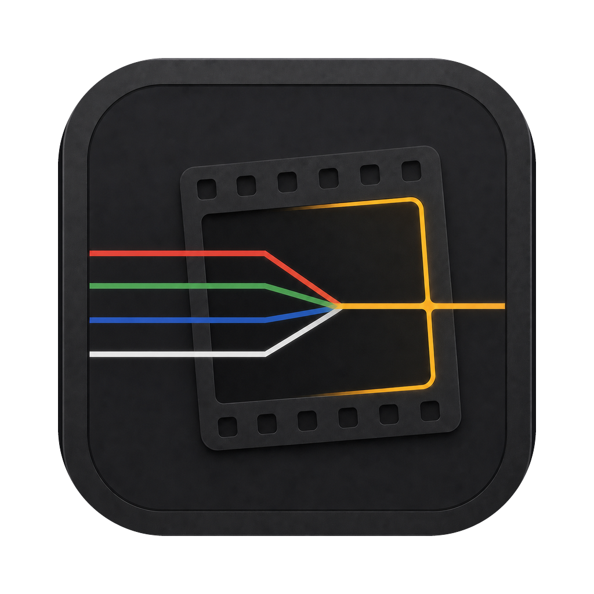
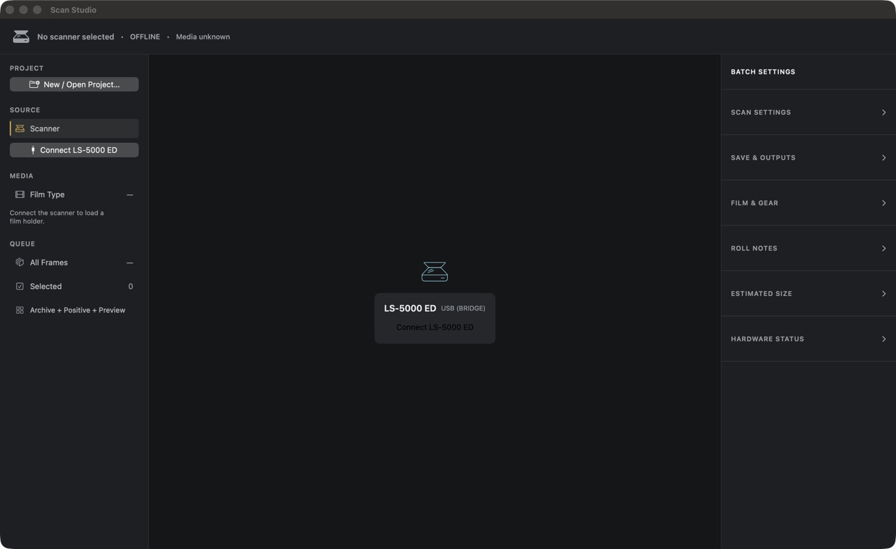

# ScanStudio

ScanStudio is a native macOS alpha for scanning 35 mm film with a Nikon SUPER COOLSCAN 5000 ED, also called the LS-5000. It replaces the practical Nikon Scan workflow on the tested setup: identify the loaded holder, preview the film, choose frames, set the recipe and outputs, scan, and stop safely when needed.

The screenshot above is the current installed app. The LS-5000 ED has been detected through the bridge and is offered as a Connect target, but it is not connected. The app is OFFLINE, the simulator is absent, and no media, preview, or scan image is displayed.

## Alpha scope

Real scanning has been tested on one Mac and one LS-5000 setup. Treat that as a narrow, useful result rather than a promise for every Coolscan, adapter, Mac, operating system, or film holder. The hardware bridge can move film, so stay nearby and supervise any real job.

The source is still under active development. The release DMG is an alpha,
ad-hoc-signed build rather than a notarized Developer ID distribution; there is
no support or release-schedule promise.

## Download

The current Apple Silicon DMG is published on the
[GitHub Releases page](https://github.com/rohanpandula/ScanStudio/releases).
It targets macOS 14 or newer and contains the app, the GPL hardware bridge and
CoolscanPy source required for redistribution, and the applicable dependency
notices. Because this alpha is not notarized, macOS may require the normal
Control-click **Open** confirmation on first launch. Do not disable Gatekeeper
globally.

## What it does

- Detects the reported carrier and media when the scanner can provide them, while keeping simulator and real hardware visibly distinct.
- Previews the roll or strip, presents a contact sheet, and supports selected-frame or batch scanning with a Stop control.
- Keeps scan settings, film stock, recipes, camera and lens metadata, naming, and save location together.
- Writes positive TIFF or JPEG outputs, with an optional high-bit-depth master TIFF for archival work.
- Uses Digital ICE only where a suitable infrared channel is available. For traditional silver black-and-white film, infrared ICE stays disabled and software dust cleanup is a separate option.
- Records receipts so a finished scan can be reviewed after the job completes.

## What is a Coolscan?

A Coolscan is a dedicated film scanner. It reads a negative or slide directly instead of photographing it with a camera. The LS-5000 is older hardware, but its 4000 dpi film scans and infrared capability on many color films still make it useful. ScanStudio supplies a current macOS workflow around that hardware; it does not claim support for every Nikon film scanner.

## The 1:1 archive bundle

ScanStudio can create an optional archive bundle for a completed frame. It is a record of the capture, not a substitute for the image. Depending on what the job actually produced, it can include the separate RGB master, conditional infrared and meter or prepass evidence, effective settings and alignment, engine and bridge receipts, bridge attempt journals only when their exact evidence root is reported, and a manifest with checksums.

The bundle names missing evidence instead of inventing it. It does not replace or rewrite the capture files.

## Safety and limits

- Preview establishes the current registration. Preview again after a refeed or ejection.
- Confirm that the app identifies a real scanner before treating it as hardware. The built-in simulator is for safe workflow exploration only.
- Keep physical film transport under supervision. Stop and inspect the scanner if the physical state is uncertain.
- Do not post scans, private paths, device serial numbers, or raw capture journals in a public issue.

## Source and feedback

Source: <https://github.com/rohanpandula/ScanStudio>

Issues: <https://github.com/rohanpandula/ScanStudio/issues>

## License boundary

The ScanStudio app, engine, site, and documentation in this repository are offered under MIT unless a file says otherwise. Real LS-5000 access uses a separate `scanstudio-bridge` program and its CoolscanPy dependency, both GPL-3.0-only. The bridge is not part of the MIT-only app boundary.

Any distribution that includes the bridge must keep its GPL-3.0-only license, corresponding source, and applicable dependency notices with that distribution. Do not describe such a bundle as MIT-only.

ScanStudio is independent software. Nikon, Coolscan, SUPER COOLSCAN, Nikon Scan, and Digital ICE are trademarks or registered trademarks of their respective owners. No affiliation or endorsement is claimed.
