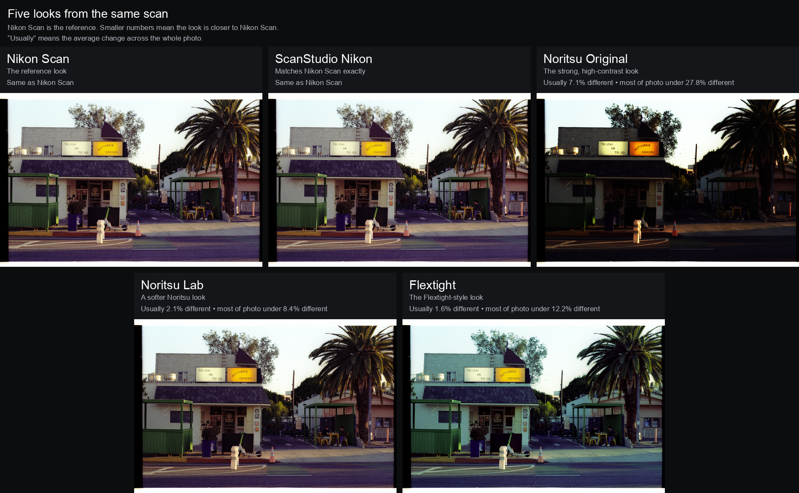

# Color in ScanStudio

ScanStudio always keeps your original scan safe. The color choice only changes
the Positive and Preview files it makes from that scan. You can change the
look later without scanning the film again.

## The choices

### Nikon Scan

This is the normal choice for C-41 negatives. It aims for the familiar Nikon
Scan result: natural colour, open shadows, and a balanced amount of contrast.

When ScanStudio has the matching Nikon builder files from that exact scan, it
uses them to match the Nikon result. If those files are not available, it uses
ScanStudio's built-in Nikon look instead.

### XXX (Testing)

This section is for alternate looks. It does not change the original scan.

- **Noritsu Lab** keeps a little of the deeper, punchier Noritsu feeling, but
  avoids the very dark shadows and strong contrast of the full curve.
- **Flextight** follows the colour and tone direction from the Flextight film
  settings you choose. Your files stay on your computer; ScanStudio does not
  copy them into the project.

## What the looks look like

The image below uses one scan in all five panels. Nikon Scan is the reference.
The closer a panel is to Nikon Scan, the smaller the number shown above it.

The original Noritsu curve is included only as a reference. It is much more
contrasty than the version people usually want from a finished lab scan.
Noritsu Lab is the gentler option.

## How these looks were developed

The work started with real scans, matching finished images, and repeated
side-by-side checks on the same film frames. We looked at daylight, shadows,
skin tones, bright signs, and neutral areas rather than relying on a single
test chart.

For Nikon Scan, the important part is using the settings that belong to the
same scan. For the alternate looks, the goal is not to claim that every
scanner behaves the same; it is to give you useful, clearly named choices that
stay close to the film while offering a different finish.

## A simple rule of thumb

Start with **Nikon Scan**. Try **Noritsu Lab** if you want a little more
weight and warmth. Try **Flextight** if that is the look you know and want to
compare. Your master scan remains unchanged whichever one you choose.
